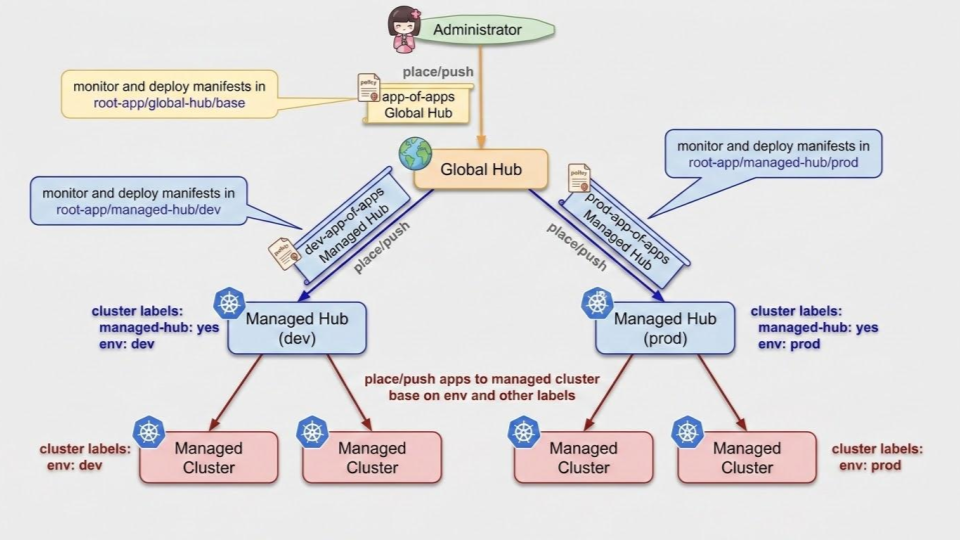

:icons: font
ifdef::env-github[]
:tip-caption: :bulb:
:note-caption: :information_source:
:important-caption: :heavy_exclamation_mark:
:caution-caption: :fire:
:warning-caption: :warning:
endif::[]
= Overview

The App of Apps pattern leverages ArgoCD declarative approach by creating one parent/root ArgoCD application that contains manifests defining other ArgoCD applications. This creates a hierarchical structure where the parent/root application monitors a Git repository containing application definitions, automatically creating, updating, or deleting child applications based on changes to these manifests.

This diagram illustrates how different components (Multicluster Global Hub, Red Hat Advanced Cluster Managed, and OpenShift GitOps) integrate to deliver high-scale multicluster management. The parent/root application is the xref:apps/00-global-hub-app-of-apps[global-hub-app-of-apps ArgoCD application], which automatically syncs manifests from GitHub to managed hubs and managed clusters.

== Repository Folders

[source,bash]
----
├── apps                                # argocd applications/applicationSets
│   ├── 00-global-hub-app-of-apps       # app-of-apps deployment for multicluster global hub
│   │   └── base
│   ├── 00-managed-hub-app-of-apps      # app-of-apps deployment for managed hub
│   │   ├── base
│   │   └── overlays
│   │       ├── dev
│   │       ├── prod
│   │       └── uat
│   ├── 01-managed-hub-bootstrap        # bootstrap managed hub, deploys the following to manage hub:
│   │   ├── dev                         #   - rhacm and openshift-gitops
│   │   ├── prod                        #   - rhacm integration with openshift-gitops
│   │   └── uat                         #   - managed-hub-app-of-apps
│   ├── cluster-config                  # base cluster config (self-provisioner, motd, etc)
│   │   └── base
│   ├── openshift-compliance
│   │   └── base
## .
## --- snip ---                         # other argocd applications/applicationSets
## .
├── bootstrap                           # ansible playbook to bootstrap multicluster global hub
│   └── ansible
│       └── tasks
├── helm-charts                         # helm charts; the charts are used by argocd
│   ├── multicluster-global-hub         # applications/applicationSets in the apps folder
│   │   └── templates
│   │       ├── global-hub
│   │       └── operator
│   ├── openshift-compliance
│   │   └── templates
│   │       ├── operator
│   │       └── scan
## .
## --- snip ---                         # other helm charts
## .
├── images
├── kustomize-deployments               # kustomize-deployments; the deployments are used by
│   ├── motd                            # argocd applications/applicationSets in the apps folder
│   │   └── base
│   ├── openshift-insights
│   │   └── base
## .
## --- snip ---                         # other kustomize deployments
## .
├── misc
├── rhacm-policies                      # rhacm policies
│   └── base
│       ├── config                      # manifests for rhacm configuration policies
│       │   └── rhacs
│       └── monitor                     # manifests for rhacm monitoring policies
└── root-app                            # root apps; app of apps deploys apps defined here
    ├── global-hub                      # for multicluster global hub
    │   └── base
    └── managed-hub                     # for managed hub of each env
        ├── base
        └── overlays
            ├── dev
            ├── prod
            └── uat
----

== Usage

=== MultiCluster Global Hub Use Case

This is a use case where a MultiCluster Global Hub manages a number of RHACM managed hub clusters, and each managed hub cluster manages a number of manageClusters.

[source,bash]
----
ansible-playbook -i localhost, bootstrap/ansible/bootstrap.yaml -e config=basic -e global_hub=yes
----

The ansible playbook performs the following on the global Hub cluster:

- Deploys RHACM.
- DeploysOpenShift GitOps.
- Enable RHACM integration with OpenShift GitOps.
- Deploys MultiCluster Global Hub.
- Deploys global hub app-of-apps (`root-app/global-hub/base`); the app-of-apps, in turn deploys:
** app-of-apps for managed hub (`root-app/managed-hub/overlays/<dev|uat|prod>`) to dev/uat/prod managed hubs:
*** `dev` managed hubs labels: `managed-hub=yes`, `env=dev`.
*** `uat` managed hubs labels: `managed-hub=yes`, `env=uat`.
*** `prod` managed hubs labels: `managed-hub=yes`, `env=prod`.
** RHACM policies (`apps/rhacm-policies/base`) to `local-cluster`.
** cluster config (`apps/cluster-config/base`) such as disable self provisioner, disable insights/telemetry services, etc, to `local-cluster`.
** other ArgoCD applications to `local-cluster`.

[NOTE]
====
- Make sure to run playbook from host with `oc` and `helm` command line tools.
- Make sure to `oc login` to the OpenShift cluster with `custer-admin` privileges before running the Ansible playbook.
====

=== Regular RHACM Use Case

This is a use case where a regular RHACM hub cluster manages a number of manageClusters.

[source,bash]
----
ansible-playbook -i localhost, bootstrap/ansible/bootstrap.yaml -e config=basic -e global_hub=no -e env=dev
----

The ansible playbook performs the following on the managed hub cluster:

- Deploys RHACM.
- Deploys OpenShift GitOps.
- Enable RHACM integration with OpenShift GitOps.
- deploys managed hub app-of-apps (`root-app/managed-hub/overlays/<dev|uat|prod>`) to dev/uat/prod managed hubs; the app-of-apps, in turn deploys:
** RHACM policies (`apps/rhacm-policies/base`) to `local-cluster`.
** cluster config (`apps/cluster-config/base`) such as disable self provisioner, disable insights/telemetry services, etc, to managed clusters.
** other ArgoCD applications to managed clusters.

== Implementation Considerations

. The RHACM PolicyGenerator plugin is not preinstalled in the OpenShift GitOps container image. To resolve this, an InitContainer is added to the repo server pod to copy the PolicyGenerator binary from link:https://catalog.redhat.com/en/software/containers/rhacm2/multicluster-observability-rhel9-operator/65a6ebeb202d91251cb0e712?image=69fa2e7a14ce65b274e8c446&architecture=amd64[RHACM Application Subscription container image] to the correct Kustomize plugin directory within the ArgoCD repo server. See https://docs.redhat.com/en/documentation/red_hat_advanced_cluster_management_for_kubernetes/2.16/html-single/gitops/index#integrate-pol-gen-ocp-gitops for more details.

. ArgoCD disabled external plugins by default for security reasons, preventing external plugins from loading:
** To use Helm charts within an ArgoCD Application that utilizes Kustomize, the `--enable-helm` flag must be enabled. For OpenShift GitOps, this is configured via by adding `kustomizeBuildOptions: --enable-helm` to `argocds.argoproj.io/openshift-gitops` resource.
** To use RHACM PolicyGenerator within an ArgoCD Application that utilizes Kustomize, the `--enable-alpha-plugins` flag must be enabled. For OpenShift GitOps, this is configured via by adding `kustomizeBuildOptions: --enable-helm` to `argocds.argoproj.io/openshift-gitops` resource.

. The default configuration of the ArgoCD server does not grant any privileges to user login via external identity provider (such as OpenShift); RBAC is configured by changing the `rbac` of `argocds.argoproj.io/openshift-gitops` resource. See https://argo-cd.readthedocs.io/en/stable/operator-manual/rbac/ for more details.

. The `argocd.argoproj.io/managed-by: openshift-gitops` label is used to grant ArgoCD namespace Admin privileges to manage resources in other target namespaces.

. OpenShift GitOps v1.20.x does not support Helm lookup function. See https://github.com/argoproj/argo-cd/issues/21745 for more details.

. For Application/ApplicationSet that deploys Custom Resource (CR) alongside or before their operator (which deploys Custom Resource Definitions, CRDs) are deployed/registered in the cluster, the `argocd.argoproj.io/sync-options: SkipDryRunOnMissingResource=true` annotation should be added to the instance/operand/CR manifest. The `SkipDryRunOnMissingResource=true` sync option allows ArgoCD to bypass dry-run validation.

. On `in-cluster` (local cluster where ArgoCD is deployed), the ServiceAccount `openshift-gitops-argocd-application-controller` in `openshift-gitops` namespace does not have enough privileges to add/delete/update some resources (such as `configs.samples.operator.openshift.io`), the `supplementary-rbac-argocd-application-controller` ClusterRole/ClusterRoleBinding grants supplementary privileges to the ServiceAccount. Without the supplementary privileges, ArgoCD will failed to sync with the following error:
+
[source,bash]
----
Failed last sync attempt to [df95491967903498aea9898a72c5cb202650222c df95491967903498aea9898a72c5cb202650222c df95491967903498aea9898a72c5cb202650222c]: one or more objects failed to apply, reason: error when patching "/dev/shm/4227123794": configs.samples.operator.openshift.io "cluster" is forbidden: User "system:serviceaccount:openshift-gitops:openshift-gitops-argocd-application-controller" cannot patch resource "configs" in API group "samples.operator.openshift.io" at the cluster scope (retried 5 times).
----
+
[NOTE]
====
For remote clusters, ArgoCD uses the ServiceAccount token (`argocd-manager` ServiceAccount in `kube-system` namespace) when appliying resources on those clusters, the token has `cluster-admin` privileges.
====

. All RHACM ManagedClusters, except the `local-cluster`, should be added to the `gitops-clusters` ClusterSet.

== Issues

=== ArgoCD Applications Stuck in "Unknown" Status

The controller cannot determine if the desired state (Git) matches the live state (Cluster), often due to component failures, connectivity issues, or resource conflicts. The most common root causes are a crashed or OOMKilled application controller, Redis downtime, repo server manifest generation failures, or missing Custom Resource Definitions (CRDs).

To resolve this, first check the health of core ArgoCD components by running `oc -n openshift-gitops get pods` and inspecting logs for the application controller and Redis. If the controller is not processing apps, restart the controller (`oc -n openshift-gitops rollout restart statefulsets/openshift-gitops-application-controller`) or increase its memory limits if it was OOMKilled. If Redis is unresponsive, restart it and then the controller.

== References

- link:https://oneuptime.com/blog/post/2026-02-26-argocd-ordering-priority-multiple-sources/view[ArgoCD resource ordering]
- link:https://access.redhat.com/solutions/6012601[OpenShift GitOps sync is failing in user namespace]

=== Login to Hub OpenShift GitOps

[source,bash]
----
argocd login "$(oc -n openshift-gitops get route openshift-gitops-server -o jsonpath={'.spec.host}'):443" \
  --skip-test-tls --username admin \
  --password "$(oc -n openshift-gitops get secret openshift-gitops-cluster -o jsonpath='{.data.admin\.password}' | base64 -d)"
----

=== Add Clusters to ArgoCD

[NOTE]
====
This is not required when RHACM integration with OpenShift GitOps is enabled. RHACM automatically adds ManageClusters to OpenShift GitOps. and syncs all labels on the ManageClusters to ArgoCD clusters.
====

[source,bash]
----
argocd cluster add cluster01 --server="$(oc -n openshift-gitops get route openshift-gitops-server -o jsonpath='{.spec.host}')" --label rhacs-secured-cluster=enable --insecure --yes
----

The command performs the followings:

- on the target/managed cluster:
** creates `argocd-manager` ServiceAccount in `kube-system` namespace.
** grants `argocd-manager` ServiceAccount cluster-admin privileges (ClusterRole: `argocd-manager-role`, ClusterRoleBinding: `argocd-manager-role-binding`).
** creates a bearer token (that never expire, no `exp` claim) with the `argocd-manager` ServiceAccount.
- on the hub cluster:
** create a secret with the properties:
*** name: cluster01
*** server: url of the target/managed
*** config: dict containing bearer token (`bearerToken`)
